# Shader_Beginner
记录了我学Shader过程中的一些案例

unity editor version: 2022.3.34

## Built-in管线案例

### E2_Character

 一个支持光照和阴影的人物Shader，在不同配置下拥有不同的阴影投射方式

支持溶解效果

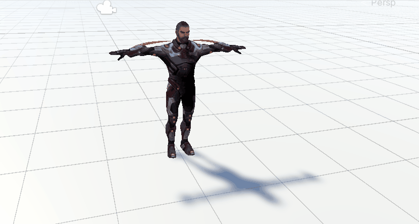

支持X光效果

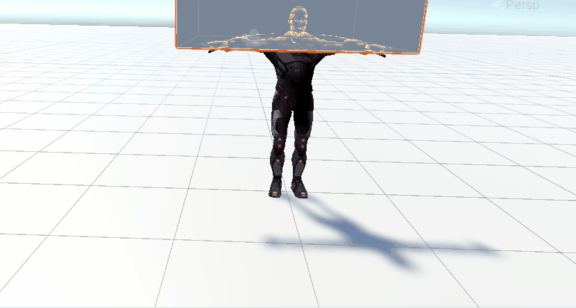

### E4_HeatDistort

扭曲效果

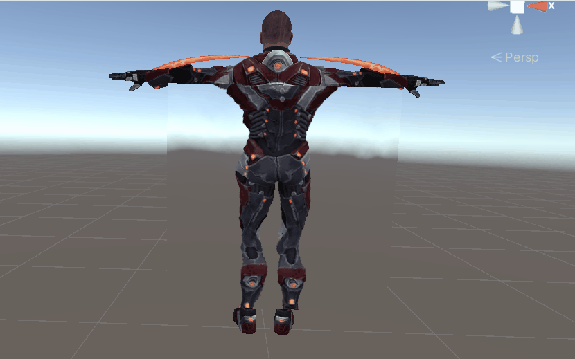

### E13_GPUInstancing

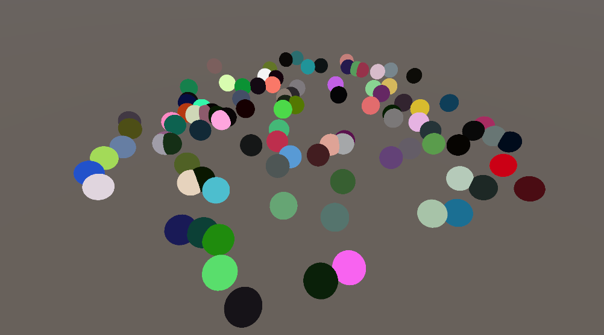

## URP管线案例

### E2_Ghost

幽灵扭曲效果

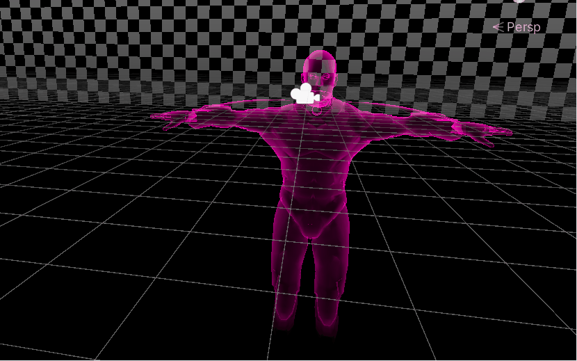

### E6_BillBoard

告示牌效果，始终面对相机

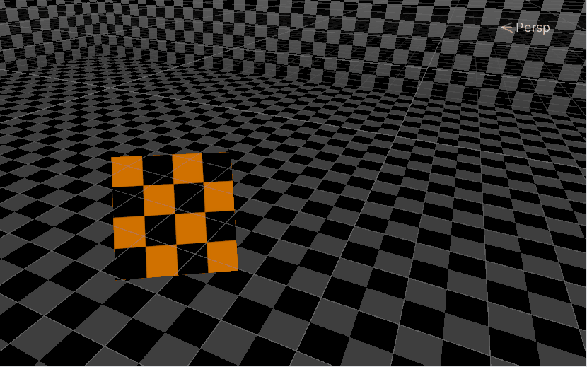

### E9_EnergyShield

能量罩效果

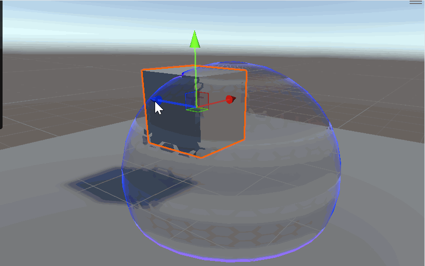

### E10_DepthDecal

深度贴花效果

### E13_Water

水面效果

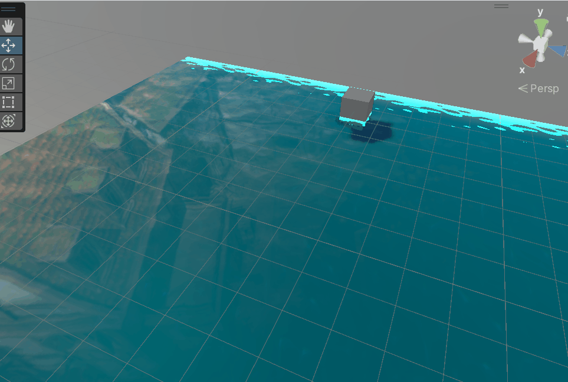

### E14_Translucent

透射效果

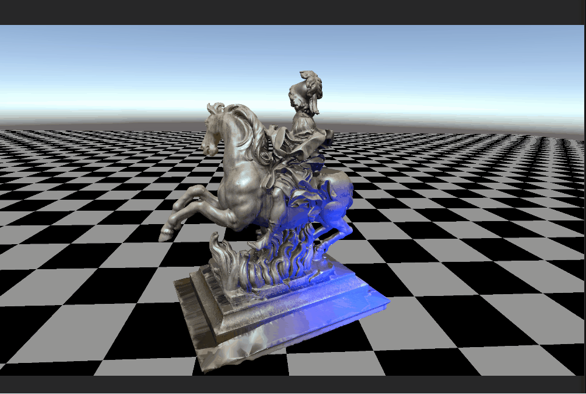

### E15_Crack

裂缝效果

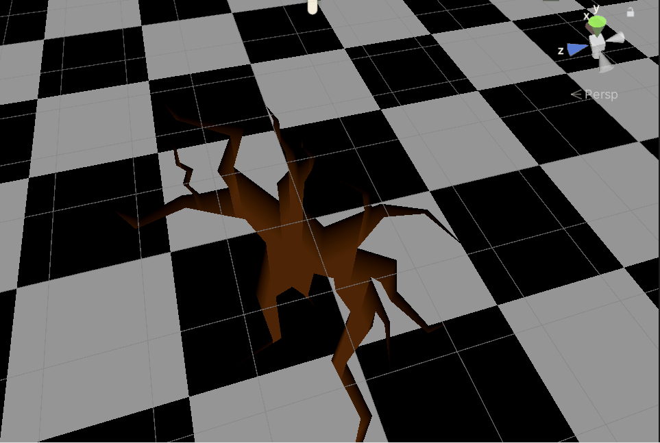

### E16_Cartoon

基于经验光照模型的卡通渲染效果

由于未在DCC软件中做点法线平均化，所以描边效果有些不对

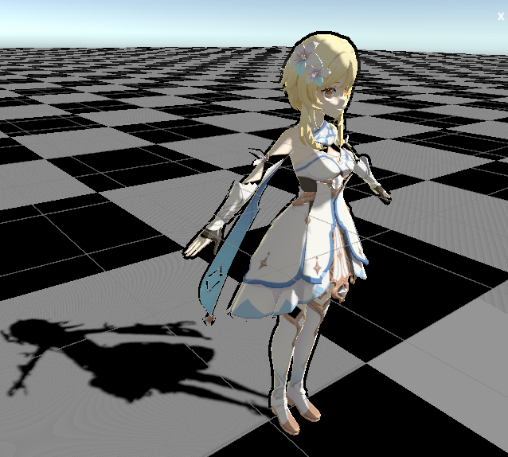

### E17_ParallaxMap

视差映射效果

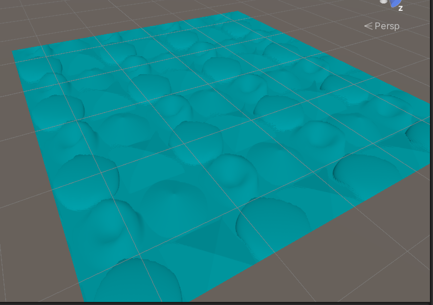

### E18_Gem

宝石效果

### E19_Hair

各向异性头发

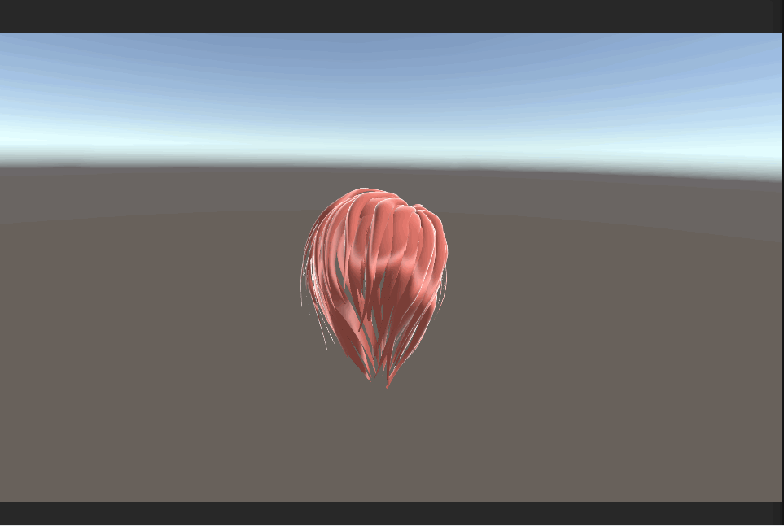
