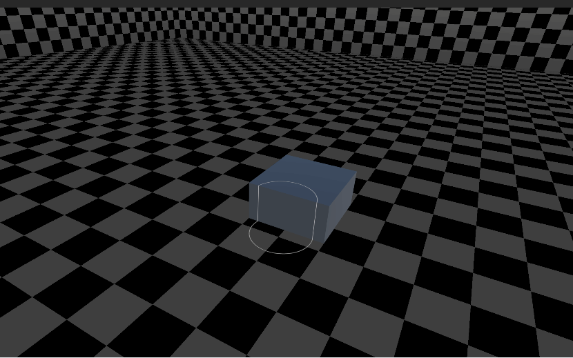
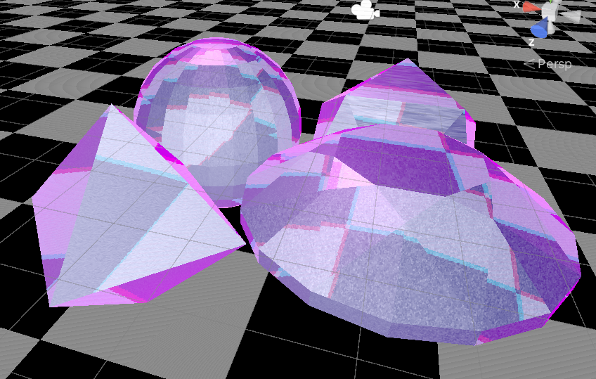

# Shader_Beginner
记录了我学Shader过程中的一些案例

unity editor version: 2022.3.34

## Built-in管线案例

### E2_Character

 一个支持光照和阴影的人物Shader，在不同配置下拥有不同的阴影投射方式

支持溶解效果

支持X光效果

### E4_HeatDistort

扭曲效果

### E13_GPUInstancing

## URP管线案例

### E2_Ghost

幽灵扭曲效果

### E6_BillBoard

告示牌效果，始终面对相机

### E9_EnergyShield

能量罩效果

### E10_DepthDecal

深度贴花效果

### E13_Water

水面效果

### E14_Translucent

透射效果

### E15_Crack

裂缝效果

### E16_Cartoon

基于经验光照模型的卡通渲染效果

由于未在DCC软件中做点法线平均化，所以描边效果有些不对

### E17_ParallaxMap

视差映射效果

### E18_Gem

宝石效果

### E19_Hair

各向异性头发

